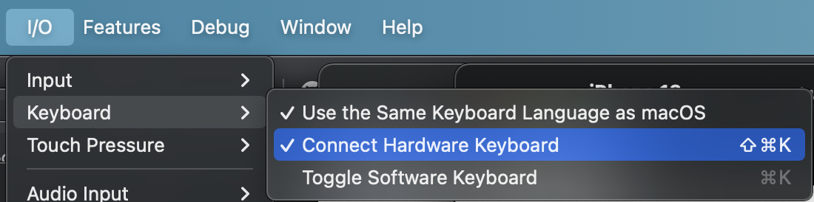
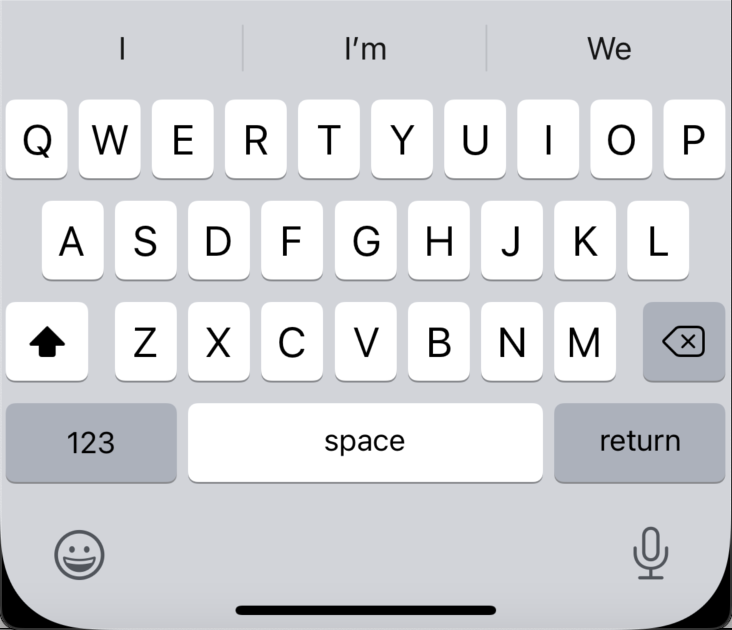

[//]: # (TODO: method1, method2, method3)

<p>
  <a href="https://github.com/vinceplusplus/ios-simulator-keyboard-and-ci/actions?query=workflow%3Amethod1+event%3Apush">
    
  </a>
  <a href="https://github.com/vinceplusplus/ios-simulator-keyboard-and-ci/actions?query=workflow%3Amethod2+event%3Apush">
    
  </a>
  <a href="https://github.com/vinceplusplus/ios-simulator-keyboard-and-ci/actions?query=workflow%3Amethod3+event%3Apush">
    
  </a>
  <a href="https://github.com/vinceplusplus/ios-simulator-keyboard-and-ci/actions?query=workflow%3Amethod4+event%3Apush">
    
  </a>
</p>

# ios-simulator-keyboard-and-ci

`ios-simulator-keyboard-and-ci` aims to address 2 issues commonly encountered when UI testing a text field (e.g. `UITextField`) on CI:
- Bringing up the software keyboard
- Bypassing the keyboard onboarding/tutorial screen in a clean environment

When UI testing a text field, there are 2 ways to get our desired input into it:

```swift
// let textField: XCUIElement
textField.tap()
textField.typeText("abc")
```

```swift
// let app: XCUIApplication
// let textField: XCUIElement
textField.tap()
app.keys["a"].tap()
app.keys["b"].tap()
app.keys["c"].tap()
```

The first one is through a synthesized hardware keyboard and requires `Connect Hardware Keyboard`



The second one requires the software keyboard to be already on the screen



If we want to mimic the real world usage, the second one should be preferred

## Bringing up software keyboard

Inspired by https://stackoverflow.com/questions/38010494/is-it-possible-to-toggle-software-keyboard-via-the-code-in-ui-test, there are 4 ways to go about that.

### Method 1

Source: https://stackoverflow.com/a/57618331

This one is achieved through the use of some private API in the app target

```swift
#if targetEnvironment(simulator)
class HardwareKeyboardDisablingHack {
  static let shared = HardwareKeyboardDisablingHack()

  private let setter = NSSelectorFromString("setHardwareLayout:")
  private let getter = NSSelectorFromString("hardwareLayout")
  private(set) var hardwareKeyboardIsDisabled = false
  private var originalState = [UITextInputMode: AnyObject]()

  func disableHardwareKeyboard() {
    if !hardwareKeyboardIsDisabled {
      UITextInputMode.activeInputModes.forEach {
        if
          $0.responds(to: getter) && $0.responds(to: setter),
          let value = $0.perform(getter)
        {
          originalState[$0] = value.takeUnretainedValue()
          $0.perform(setter, with: nil)
        }
      }
      
      hardwareKeyboardIsDisabled = true
    }
  }
  
  func enableHardwareKeyboard() {
    if hardwareKeyboardIsDisabled {
      originalState.forEach {
        $0.key.perform(setter, with: $0.value)
      }
      
      hardwareKeyboardIsDisabled = false
    }
  }
}
#endif

// ...

HardwareKeyboardDisablingHack.disableHardwareKeyboard()
// ...
HardwareKeyboardDisablingHack.enableHardwareKeyboard()


```

Pros:
- Easy to implement one off disabling from launch
- Can achieve both disabling and enabling
- Doesn't change the simulator app's settings
- Change persists only the current app instance

Cons:
- Private API
- Extra code in app target
- If both disabling and enabling are needed, app targets needs to provide interface

### Method 2

This one is through having a `ConnectHardwareKeyboard = false` entry for the desired simulator in the defaults plist for `com.apple.iphonesimulator` 

```shell
#!/bin/bash

# example: ./disable_hardware_keyboard_by_plist.sh "iPhone 13"

# inspired here, https://stackoverflow.com/questions/38010494/is-it-possible-to-toggle-software-keyboard-via-the-code-in-ui-test

# shutdown everything
xcrun simctl shutdown all
killall "Simulator"

sleep 1

# desired device type, cater to only filter by device type
device_type=$1

# grab the first eligible UDID
filtered_line=$(xcrun simctl list devices | grep "${device_type} (" | head -1)
echo "> from: ${filtered_line}"
udid=$(echo "$filtered_line" | grep -E -o ".{8}-.{4}-.{4}-.{4}-.{12}")
echo "> chosen UDID: ${udid}"

domain="com.apple.iphonesimulator"

# flush cache
defaults read $domain > /dev/null

eval plist_file_path=~/Library/Preferences/${domain}.plist
echo "> plist file path: ${plist_file_path}"

# try to add (will create file if necessary). if not, replace (need entry already there)
/usr/libexec/PlistBuddy -c "add :DevicePreferences:${udid}:ConnectHardwareKeyboard bool false" ${plist_file_path} \
|| /usr/libexec/PlistBuddy -c "set :DevicePreferences:${udid}:ConnectHardwareKeyboard false" ${plist_file_path}

defaults read $domain > /dev/null

xcrun simctl boot "${udid}"
open -a Simulator.app

echo "> completed"
```

Pros:
- Easy to implement for CI
- No extra code in app target

Cons:
- Private API
- Changes the simulator app's settings
- Cannot achieve both disabling and enabling

### Method 3

This one is through checking the same plist as in method 2 and toggle it off in the simulator app by an automation AppleScript

```shell
#!/bin/bash

# example: ./disable_hardware_keyboard_by_automation.sh "iPhone 13"

# inspired here, https://stackoverflow.com/questions/38010494/is-it-possible-to-toggle-software-keyboard-via-the-code-in-ui-test

device_type=$1

filtered_line=$(xcrun simctl list devices | grep "${device_type} (" | head -1)
echo "> from: ${filtered_line}"
udid=$(echo "$filtered_line" | grep -E -o ".{8}-.{4}-.{4}-.{4}-.{12}")
echo "> chosen UDID: ${udid}"

xcrun simctl boot "${udid}"
open -a Simulator.app

echo "> wait for the simulator to launch"

sleep 5

domain="com.apple.iphonesimulator"

# flush cache
defaults read $domain > /dev/null

eval plist_file_path=~/Library/Preferences/${domain}.plist
echo "> plist file path: ${plist_file_path}"

is_hardware_keyboard_connected=$(/usr/libexec/PlistBuddy -c "print DevicePreferences:${udid}:ConnectHardwareKeyboard" ${plist_file_path})
echo "> is_hardware_keyboard_connected: ${is_hardware_keyboard_connected}"

if [ "$is_hardware_keyboard_connected" != "false" ]; then
  echo "> will uncheck hardware keyboard"
osascript <<EOD
  tell application "Simulator" to activate
  tell application "System Events"
      keystroke "K" using {command down, shift down}
  end tell
EOD

  sleep 1

  echo "> verify..."

  defaults read $domain > /dev/null

  is_hardware_keyboard_connected=$(/usr/libexec/PlistBuddy -c "print DevicePreferences:${udid}:ConnectHardwareKeyboard" ${plist_file_path})
  echo "> is_hardware_keyboard_connected: ${is_hardware_keyboard_connected}"
fi

echo "> completed"
```

Pros:
- Easy to implement for CI
- No extra code in app target

Cons:
- Private API
- Changes the simulator app's settings
- Cannot achieve both disabling and enabling
- Uses a larger API surface area than method 2
- Use of automation requires accessibility permission granted (works out of the box on GitHub Actions)

### Method 4

This one is achieved through a host helper daemon to listen for request to toggle software keyboard by an automation
AppleScript. There will be extra code to execute in test cases after focusing on a text field to control whether a
hardware or software keyboard will be used

Daemon implementation using `Vapor`:
```swift
import Vapor

// https://stackoverflow.com/a/50035059
func safeShell(_ command: String) throws -> String {
  let task = Process()
  let pipe = Pipe()
  
  task.standardOutput = pipe
  task.standardError = pipe
  task.arguments = ["-c", command]
  task.executableURL = URL(fileURLWithPath: "/bin/zsh")
  
  try task.run()
  
  let data = pipe.fileHandleForReading.readDataToEndOfFile()
  let output = String(data: data, encoding: .utf8)!
  
  return output
}

func routes(_ app: Application) throws {
  app.get { req in
    return "catch all handler"
  }
  
  app.get("toggle-software-keyboard") { req -> String in
    let path = Bundle.module.path(forResource: "toggle-software-keyboard.sh", ofType: nil)!
    return (try? safeShell("\(path)")) ?? ""
  }
}
```

Script to launch the daemon:
```shell
cd toggle-software-keyboard
swift build
swift run &
cd ..
scripts/wait-for-toggle-software-keyboard-service.sh
```

Script to wait for the daemon to come online:
```shell
#!/bin/bash

# https://stackoverflow.com/a/50583452

attempt_counter=0
max_attempts=5

until $(curl --output /dev/null --silent --head --fail http://localhost:8080); do
    if [ ${attempt_counter} -eq ${max_attempts} ];then
      echo "Max attempts reached"
      exit 1
    fi

    printf '.'
    attempt_counter=$(($attempt_counter+1))
    sleep 5
done
```

Utility to control whether a hardware/software keyboard will be used:
```swift
import XCTest

extension XCTestCase {
  func toggleSoftwareKeyboard() {
    let expectation = expectation(description: "Software Keyboard Toggle Request")
    Task {
      do {
        let url = URL(string: "http://localhost:8080/toggle-software-keyboard")!
        let (_, response) = try await URLSession.shared.data(for: .init(url: url))
        if
          let response = response as? HTTPURLResponse,
          (200...299).contains(response.statusCode)
        {
          expectation.fulfill()
        } else {
          XCTFail()
        }
      } catch {
        XCTFail()
      }
    }
    wait(for: [expectation], timeout: 5)
  }
  
  func showSoftwareKeyboardByAutomation(_ app: XCUIApplication, shows: Bool) {
    let key1 = app.keys["A"]
    let key2 = app.keys["a"]
    let key3 = app.keys["b"]
    let key4 = app.keys["1"]
    
    func checkKeyboardPresence() -> Bool {
      (key1.exists && key1.isHittable) ||
      (key2.exists && key2.isHittable) ||
      (key3.exists && key3.isHittable) ||
      (key4.exists && key4.isHittable)
    }
    
    RunLoop.current.run(until: .now + 1)
    
    guard checkKeyboardPresence() != shows else {
      return
    }
    
    // NOTE: we can use the first toggle to dismiss the onboarding/tutorial screen
    toggleSoftwareKeyboard()
    RunLoop.current.run(until: .now + 1)
    if checkKeyboardPresence() != shows {
      toggleSoftwareKeyboard()
    }
    RunLoop.current.run(until: .now + 1)
  }
}
```

Usage:

```swift
app.buttons["Focus"].tap()
RunLoop.current.run(until: .now + 1)
showSoftwareKeyboardByAutomation(app, shows: true)
app.keys["A"].tap()
RunLoop.current.run(until: .now + 0.5)
app.keys["b"].tap()
RunLoop.current.run(until: .now + 0.5)
app.keys["c"].tap()
XCTAssertEqual(textField.value as? String, "Abc")
```

Pros:
- Hack free implementation
- Easy to control between hardware/software keyboards
- Does not change the simulator app's settings

Cons:
- More setup before actual testing
- Use of automation requires accessibility permission granted (works out of the box on GitHub Actions)

## Extra notes

When testing the software keyboard, a weird error and hence a failure was encountered:

```
/Users/runner/work/ios-simulator-keyboard-and-ci/ios-simulator-keyboard-and-ci/AllTests/SoftTest/SoftTest.swift:7: error: -[SoftTest.SoftTest testSoftwareKeyboard] : Failed to determine hittability of "b" Key: Activation point invalid and no suggested hit points based on element frame
```

from:

```swift
let textField = app.textFields.element(boundBy: 0)
textField.tap()
app.tapKey("A")
app.tapKey("b")
app.tapKey("c")
```

Adding a slight delay between keystrokes seems to make it go away, it could suggest a race condition

```swift
let textField = app.textFields.element(boundBy: 0)
textField.tap()
app.tapKey("A")
RunLoop.current.run(until: .now + 0.5)
app.tapKey("b")
RunLoop.current.run(until: .now + 0.5)
app.tapKey("c")
```

## Conclusion

If we need to go beyond `app.typeText()` then it's going to need a lot more efforts
